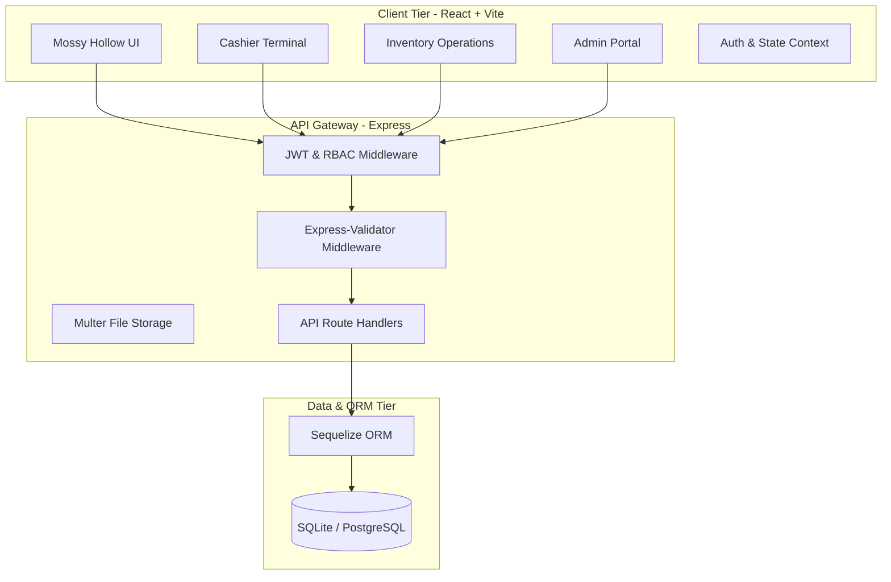

# System Architecture

## Architecture Overview
Teerop POS utilizes a decoupled client-server architecture:

### Tech Stack Details
1. **Frontend**: React 18, Vite, Framer Motion, Vanilla CSS Design System, React Icons, Axios.
2. **Backend**: Node.js, Express, Sequelize ORM, JWT, Bcrypt, Multer, Express-Validator.
3. **Database**: SQLite (Local Development) / PostgreSQL (Production on Render).
