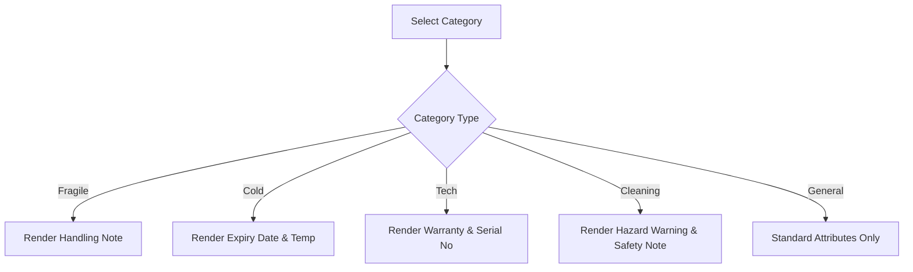

# 🏺 Multi-Category Domain Logic & Category Subtypes

The Teerop system enforces specialized domain rules across **5 distinct retail categories**, as modeled in [[02-Design/Database Schema|Database Schema]] and [[06-Diagrams/Class Diagram|Class Diagram]].

---

## 🏷️ Category Specifications Matrix

| Category | Icon | Specialized Attributes | Domain Validation Rules |
|---|---|---|---|
| **Fragile** | 🏺 | `is_fragile`, `handling_note` | Flagged with safety handling instructions and breakable packing indicators. |
| **Cold** | ❄️ | `expiry_date`, `storage_temp` | Must track expiration dates and target storage temperature (e.g. `4°C Chill`). |
| **Tech** | 💻 | `warranty_period`, `serial_number` | Requires warranty month duration and valid hardware serial number ($SN$). |
| **Cleaning** | 🧪 | `is_hazardous`, `safety_note` | Chemical hazard flag and OSHA-compliant safety warning notes. |
| **General** | 📦 | `reorder_threshold` | Standard items with reorder threshold tracking. |

---

## 🔄 Dynamic Attribute Handling in UI

When adding or editing products in the [[03-Implementation/Frontend Architecture|Frontend Catalog]], the modal dynamically renders only the relevant attribute input fields matching the selected category.

---

**Related Notes:**
- [[01-Requirements/Functional Requirements|Functional Requirements]]
- [[02-Design/Database Schema|Database Schema]]
- [[06-Diagrams/Class Diagram|Class Diagram]]
