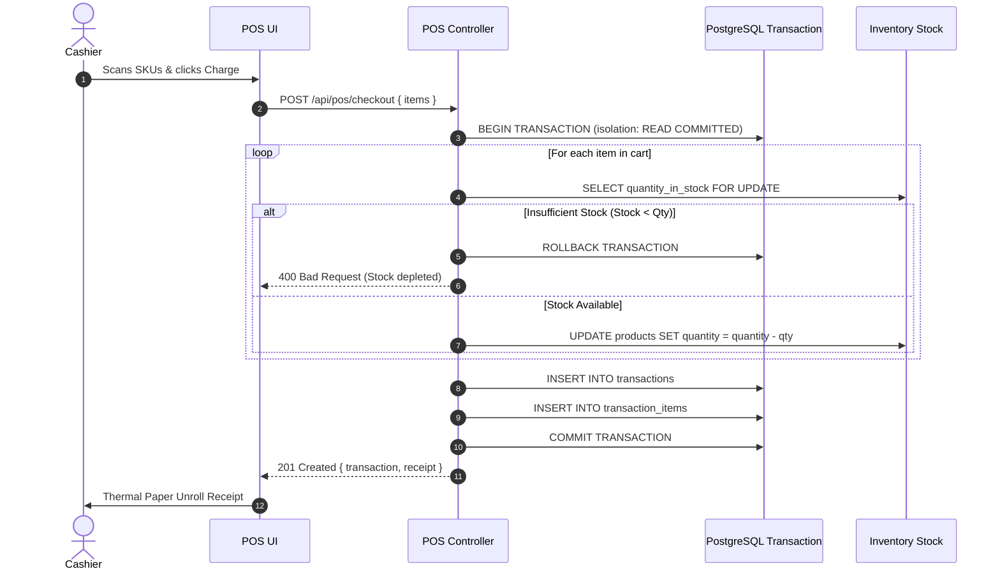

# 🛒 Atomic POS Checkout & Decrement Engine

The POS checkout process guarantees **ACID compliance** and atomic inventory protection via Sequelize Managed Database Transactions.

---

## 🔒 Transaction Execution Flow

---

## 🛡️ Key Guarantees
1. **Zero Stock Corruption**: Stock is NEVER partially decremented if checkout is interrupted.
2. **Case-Insensitive Barcode Engine**: `sequelize.where(sequelize.fn('UPPER', sequelize.col('sku')), cleanSku)` handles lowercase, uppercase, and scanner inputs identically.
3. **Receipt Generation**: Returns exact breakdown with unit prices, calculated 5% tax, and timestamp.

---

**Related Notes:**
- [[02-Design/Database Schema|Database Schema]]
- [[02-Design/20-Point Animation Suite|20-Point Animation Suite]]
- [[06-Diagrams/Sequence Diagrams|Sequence Diagrams]]
- [[06-Diagrams/Activity Diagram|Activity Diagram]]
