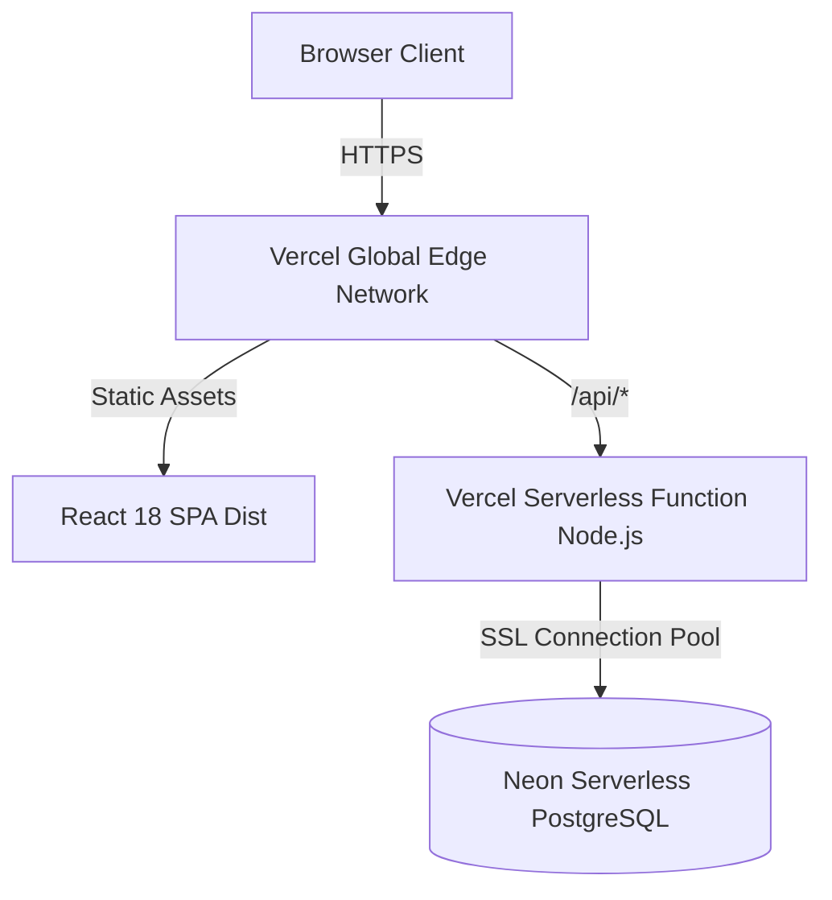

# ☁️ Live Cloud Deployment (Vercel & Neon)

The system is deployed on a modern, serverless cloud architecture.

---

## 🌐 Production Architecture

---

## 🔑 Environment Configuration

| Variable | Target Environment | Purpose |
|---|---|---|
| `DATABASE_URL` | Vercel Serverless | Neon PostgreSQL connection string with SSL. |
| `JWT_SECRET` | Vercel Serverless | Cryptographic secret for signing auth tokens. |
| `DB_SSL` | Vercel Serverless | Enforces SSL encryption (`true`). |
| `NODE_ENV` | Vercel Serverless | Production mode flag (`production`). |

---

**Related Notes:**
- [[00-Overview/00-Index|Master Navigation]]
- [[05-Deployment/DevOps & Docker Containers|DevOps & Docker Containers]]
- [[05-Deployment/Kubernetes Cluster (K8s)|Kubernetes Cluster (K8s)]]
