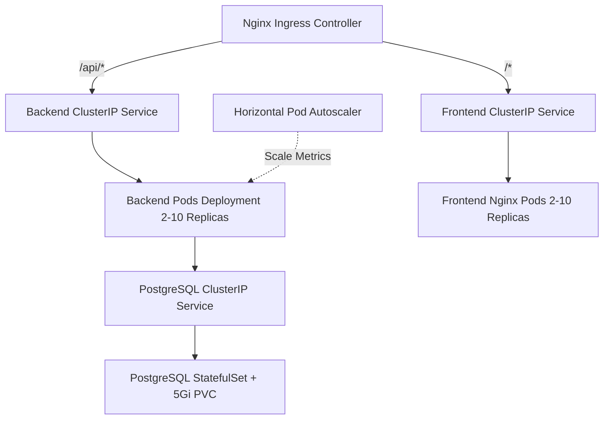

# ☸️ Kubernetes (K8s) Production Architecture

Production container orchestration is managed via modular Kubernetes manifests in the `k8s/` directory.

---

## 🏗️ K8s Component Breakdown

---

## 📁 Manifest Directory Map
- `00-namespace.yaml`: Isolated `teerop-pos` namespace.
- `01-configmap-secrets.yaml`: ConfigMaps and base64-encoded Secrets.
- `02-postgres.yaml`: StatefulSet with PersistentVolumeClaim (`pvc`).
- `03-backend.yaml`: Rolling deployment with Prometheus scraping annotations.
- `04-frontend.yaml`: Multi-replica Nginx SPA container.
- `05-ingress.yaml`: Ingress controller host routing.
- `06-hpa.yaml`: Horizontal Pod Autoscaler (scales 2 to 10 pods based on CPU/RAM load).

---

**Related Notes:**
- [[05-Deployment/DevOps & Docker Containers|DevOps & Docker Containers]]
- [[05-Deployment/Prometheus & Grafana Observability|Prometheus & Grafana Observability]]
- [[06-Diagrams/Class Diagram|Class Diagram]]
