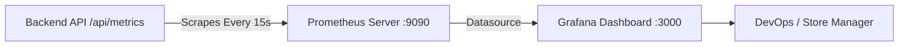

# 📊 Prometheus & Grafana Observability Architecture

Real-time telemetry and KPI observability are instrumented natively via Prometheus and Grafana.

---

## 📈 Telemetry Pipeline

---

## 🎯 Monitored Metrics

1. **Revenue Velocity**: `pos_revenue_total_dollars` (Cumulative USD gross sales).
2. **Transaction Throughput**: `pos_transactions_total` (Count of completed checkouts).
3. **HTTP Latency**: `http_request_duration_seconds` (P50, P95, P99 request latencies).
4. **Error Rates**: `http_requests_total{status=~"5.."}` (5xx and 4xx status counts).
5. **System Resources**: `process_heap_used_bytes` & `process_resident_memory_bytes`.

---

**Related Notes:**
- [[00-Overview/00-Index|Master Navigation]]
- [[05-Deployment/Kubernetes Cluster (K8s)|Kubernetes Cluster (K8s)]]
- [[05-Deployment/DevOps & Docker Containers|DevOps & Docker Containers]]
