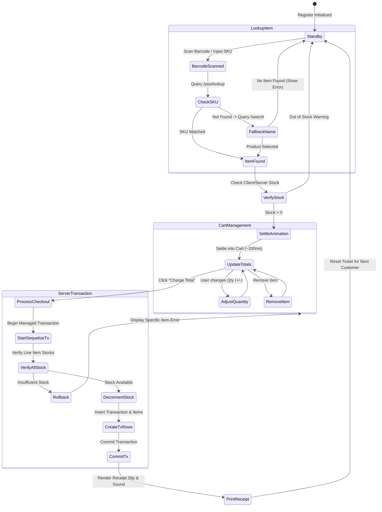

# Activity Diagram — Point of Sale Checkout Flow

```mermaid
stateDiagram-v2
    [*] --> Standby: Register Initialized
    Standby --> BarcodeScanned: Scan Barcode / Input SKU
    
    state LookupItem {
        BarcodeScanned --> CheckSKU: Query /pos/lookup
        CheckSKU --> ItemFound: SKU Matched
        CheckSKU --> FallbackName: Not Found -> Query /search
        FallbackName --> ItemFound: Product Selected
        FallbackName --> Standby: No Item Found (Show Error)
    }

    ItemFound --> VerifyStock: Check Client/Server Stock
    VerifyStock --> SettleAnimation: Stock > 0
    VerifyStock --> Standby: Out of Stock Warning

    state CartManagement {
        SettleAnimation --> UpdateTotals: Settle into Cart (~200ms)
        UpdateTotals --> AdjustQuantity: User changes Qty (+/-)
        AdjustQuantity --> UpdateTotals
        UpdateTotals --> RemoveItem: Remove Item
        RemoveItem --> UpdateTotals
    }

    UpdateTotals --> ProcessCheckout: Click "Charge Total"

    state ServerTransaction {
        ProcessCheckout --> StartSequelizeTx: Begin Managed Transaction
        StartSequelizeTx --> VerifyAllStock: Verify Line Item Stocks
        VerifyAllStock --> Rollback: Insufficient Stock
        VerifyAllStock --> DecrementStock: Stock Available
        DecrementStock --> CreateTxRows: Insert Transaction & Items
        CreateTxRows --> CommitTx: Commit Transaction
    }

    Rollback --> CartManagement: Display Specific Item Error
    CommitTx --> PrintReceipt: Render Receipt Slip & Sound
    PrintReceipt --> Standby: Reset Ticket for Next Customer
```
