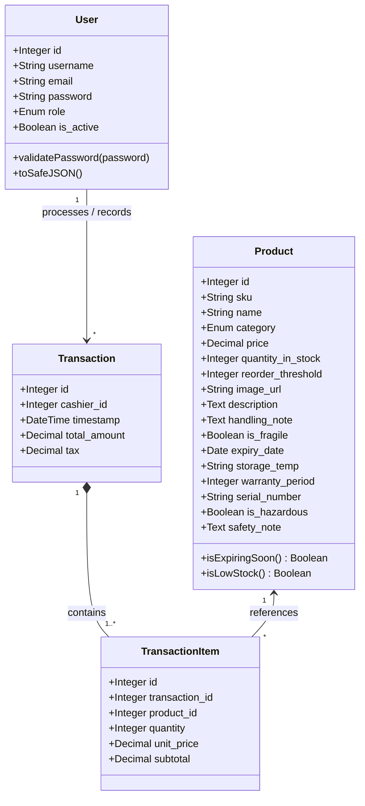

# Class Diagram

```mermaid
classDiagram
    class User {
        +Integer id
        +String username
        +String email
        +String password
        +Enum role
        +Boolean is_active
        +validatePassword(password)
        +toSafeJSON()
    }

    class Product {
        +Integer id
        +String sku
        +String name
        +Enum category
        +Decimal price
        +Integer quantity_in_stock
        +Integer reorder_threshold
        +String image_url
        +Text description
        +Text handling_note
        +Boolean is_fragile
        +Date expiry_date
        +String storage_temp
        +Integer warranty_period
        +String serial_number
        +Boolean is_hazardous
        +Text safety_note
        +isExpiringSoon() Boolean
        +isLowStock() Boolean
    }

    class Transaction {
        +Integer id
        +Integer cashier_id
        +DateTime timestamp
        +Decimal total_amount
        +Decimal tax
    }

    class TransactionItem {
        +Integer id
        +Integer transaction_id
        +Integer product_id
        +Integer quantity
        +Decimal unit_price
        +Decimal subtotal
    }

    User "1" --> "*" Transaction : processes / records
    Transaction "1" *-- "1..*" TransactionItem : contains
    Product "1" <-- "*" TransactionItem : references
```
