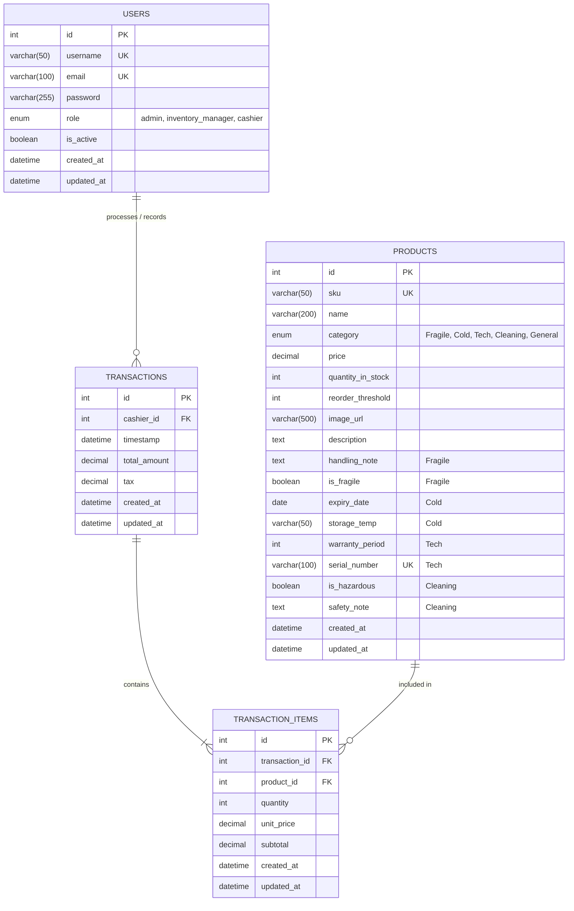

# Entity Relationship (ER) Diagram

```mermaid
erDiagram
    USERS ||--o{ TRANSACTIONS : "processes / records"
    TRANSACTIONS ||--|{ TRANSACTION_ITEMS : "contains"
    PRODUCTS ||--o{ TRANSACTION_ITEMS : "included in"

    USERS {
        int id PK
        varchar(50) username UK
        varchar(100) email UK
        varchar(255) password
        enum role "admin, inventory_manager, cashier"
        boolean is_active
        datetime created_at
        datetime updated_at
    }

    PRODUCTS {
        int id PK
        varchar(50) sku UK
        varchar(200) name
        enum category "Fragile, Cold, Tech, Cleaning, General"
        decimal price
        int quantity_in_stock
        int reorder_threshold
        varchar(500) image_url
        text description
        text handling_note "Fragile"
        boolean is_fragile "Fragile"
        date expiry_date "Cold"
        varchar(50) storage_temp "Cold"
        int warranty_period "Tech"
        varchar(100) serial_number UK "Tech"
        boolean is_hazardous "Cleaning"
        text safety_note "Cleaning"
        datetime created_at
        datetime updated_at
    }

    TRANSACTIONS {
        int id PK
        int cashier_id FK
        datetime timestamp
        decimal total_amount
        decimal tax
        datetime created_at
        datetime updated_at
    }

    TRANSACTION_ITEMS {
        int id PK
        int transaction_id FK
        int product_id FK
        int quantity
        decimal unit_price
        decimal subtotal
        datetime created_at
        datetime updated_at
    }
```
