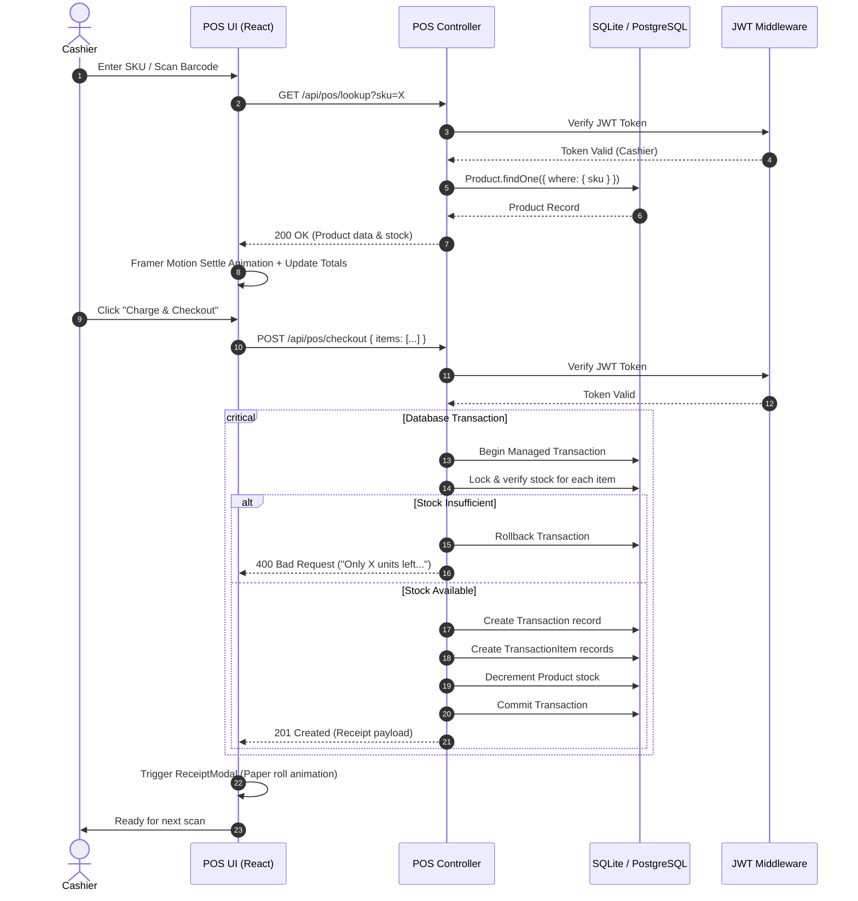
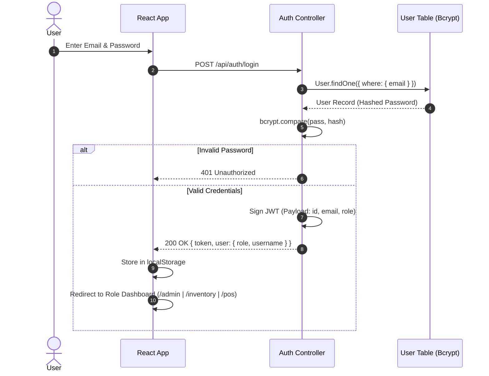

# Sequence Diagrams

## 1. POS Checkout & Atomic Stock Decrement Flow

```mermaid
sequenceDiagram
    autonumber
    actor Cashier
    participant UI as POS UI (React)
    participant POSCtrl as POS Controller
    participant DB as SQLite / PostgreSQL
    participant Auth as JWT Middleware

    Cashier->>UI: Enter SKU / Scan Barcode
    UI->>POSCtrl: GET /api/pos/lookup?sku=X
    POSCtrl->>Auth: Verify JWT Token
    Auth-->>POSCtrl: Token Valid (Cashier)
    POSCtrl->>DB: Product.findOne({ where: { sku } })
    DB-->>POSCtrl: Product Record
    POSCtrl-->>UI: 200 OK (Product data & stock)
    UI->>UI: Framer Motion Settle Animation + Update Totals

    Cashier->>UI: Click "Charge & Checkout"
    UI->>POSCtrl: POST /api/pos/checkout { items: [...] }
    POSCtrl->>Auth: Verify JWT Token
    Auth-->>POSCtrl: Token Valid

    critical Database Transaction
        POSCtrl->>DB: Begin Managed Transaction
        POSCtrl->>DB: Lock & verify stock for each item
        alt Stock Insufficient
            POSCtrl->>DB: Rollback Transaction
            POSCtrl-->>UI: 400 Bad Request ("Only X units left...")
        else Stock Available
            POSCtrl->>DB: Create Transaction record
            POSCtrl->>DB: Create TransactionItem records
            POSCtrl->>DB: Decrement Product stock
            POSCtrl->>DB: Commit Transaction
            POSCtrl-->>UI: 201 Created (Receipt payload)
        end
    end

    UI->>UI: Trigger ReceiptModal (Paper roll animation)
    UI->>Cashier: Ready for next scan
```

## 2. Authentication & Role Gateway Flow

```mermaid
sequenceDiagram
    autonumber
    actor User
    participant Frontend as React App
    participant AuthCtrl as Auth Controller
    participant UserDB as User Table (Bcrypt)

    User->>Frontend: Enter Email & Password
    Frontend->>AuthCtrl: POST /api/auth/login
    AuthCtrl->>UserDB: User.findOne({ where: { email } })
    UserDB-->>AuthCtrl: User Record (Hashed Password)
    AuthCtrl->>AuthCtrl: bcrypt.compare(pass, hash)
    alt Invalid Password
        AuthCtrl-->>Frontend: 401 Unauthorized
    else Valid Credentials
        AuthCtrl->>AuthCtrl: Sign JWT (Payload: id, email, role)
        AuthCtrl-->>Frontend: 200 OK { token, user: { role, username } }
        Frontend->>Frontend: Store in localStorage
        Frontend->>Frontend: Redirect to Role Dashboard (/admin | /inventory | /pos)
    end
```
