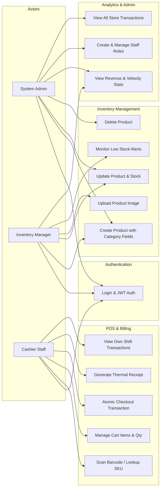

# Use Case Diagram

```mermaid
graph LR
    subgraph Actors
        Admin[System Admin]
        Manager[Inventory Manager]
        Cashier[Cashier Staff]
    end

    subgraph Authentication
        UC_Login[Login & JWT Auth]
    end

    subgraph Inventory Management
        UC_CreateProd[Create Product with Category Fields]
        UC_EditProd[Update Product & Stock]
        UC_UploadImg[Upload Product Image]
        UC_ViewLowStock[Monitor Low Stock Alerts]
        UC_DeleteProd[Delete Product]
    end

    subgraph POS & Billing
        UC_Scan[Scan Barcode / Lookup SKU]
        UC_Cart[Manage Cart Items & Qty]
        UC_Checkout[Atomic Checkout Transaction]
        UC_Receipt[Generate Thermal Receipt]
        UC_MyTx[View Own Shift Transactions]
    end

    subgraph Analytics & Admin
        UC_Stats[View Revenue & Velocity Stats]
        UC_UserMgmt[Create & Manage Staff Roles]
        UC_AllTx[View All Store Transactions]
    end

    Admin --> UC_Login
    Manager --> UC_Login
    Cashier --> UC_Login

    Cashier --> UC_Scan
    Cashier --> UC_Cart
    Cashier --> UC_Checkout
    Cashier --> UC_Receipt
    Cashier --> UC_MyTx

    Manager --> UC_CreateProd
    Manager --> UC_EditProd
    Manager --> UC_UploadImg
    Manager --> UC_ViewLowStock
    Manager --> UC_Stats

    Admin --> UC_CreateProd
    Admin --> UC_EditProd
    Admin --> UC_DeleteProd
    Admin --> UC_Stats
    Admin --> UC_UserMgmt
    Admin --> UC_AllTx
```
